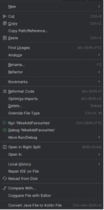

# MiTTPP_projekt

Uvod

U ovom dokumentu predstavljeni su automatski testovi napisani u Javi uz korištenje Selenium frameworka i TestNG biblioteke. Ti su testovi smješteni u direktorij src/test/java unutar projekta, a dizajnirani su za verifikaciju raznih funkcionalnosti web aplikacija, pružajući pouzdan način za identifikaciju grešaka ili potencijalnih problema prilikom promjena i unapređenja softvera. Automatsko testiranje omogućuje brže izvršavanje testova u usporedbi s ručnim testiranjem, smanjujući mogućnost ljudskih grešaka i povećavajući efikasnost testnog procesa.

Svi testovi su implementirani u razvojnog okruženju IntelliJ IDEA, jednom od najpopularnijih IDE-ova za Javu. Da bi testovi ispravno radili, potrebno je preuzeti, instalirati ChromeDriver i dodati u PATH unutar "Enviroment Variables", koji omogućava interakciju između Selenium-a i web preglednika Google Chrome.

Opis korištenja:

Kao što sam ranije naveo testovi se nalazi u direktoriju src/test/java, a svaki test se može pokrenuti na dva načina. 

Svrha i opis testova:

ChessLoginTest

Svrha: Ovaj test verificira mogućnost uspješnog prijavljivanja na Chess.com koristeći važeće korisničke podatke.
Opis: Test započinje otvaranjem stranice za prijavu na Chess.com. Nakon što se stranica učita, test unosi korisničko ime i lozinku. Simulira se akcija klika na dugme za prijavu, a nakon toga, test provjerava da li je korisnik preusmjeren na početnu stranicu igre. U slučaju neuspješne prijave, test prijavljuje grešku koristeći poruku "Prijavljivanje nije uspjelo."

FeritPageTest

Svrha: Ovaj test provjerava navigaciju do sekcije koja prikazuje studijske programe na web stranici FERIT-a.
Opis: Test započinje otvaranjem glavne stranice FERIT-a i maksimiziranjem prozora preglednika radi boljeg prikaza. Nakon toga, test klika na link s oznakom "Upisi i studiji", a zatim na link "Pregled studijskih programa". Koristeći WebDriverWait, test osigurava da se očekivana stranica uspješno učitala, a zatim provjerava URL kako bi potvrdio da je navigacija uspješna.

NikeAddToFavouritesTest

Svrha: Ovaj test omogućuje pretraživanje proizvoda na Nike web stranici i dodavanje odabranog proizvoda u favorites (omiljene).
Opis: Test otvara stranicu sa Jordan proizvodima na Nike-u i pritisne dugme za pretragu. Ispunjava polje za pretragu pojmom "Tech Fleece" i šalje upit. Nakon što se prikaže popis proizvoda, test će simulirati klik na prvi proizvod, a zatim na dugme koje omogućava dodavanje u favorite. Proverava se da li korisnik biva preusmjeren na stranicu za prijavu.

PlaytoyLoginTest

Svrha: Ovaj test verifikuje funkcionalnost prijave na Playtoy platformu, koja koristi sustav autentikacije.
Opis: Test otvara stranicu za prijavu i unosi korisničko ime i lozinku. Koristi se WebDriverWait za čekanje dok se elementi ne učitaju i postanu interaktivni. Nakon uspješne prijave, test potvrđuje da li je korisnik preusmjeren na početnu stranicu Playtoy-a, čime se osigurava da je prijava bila uspješna.

ZalandoSearchTest

Svrha: Ovaj test provjerava mogućnosti filtriranja proizvoda na Zalando web stranici.
Opis: Test započinje na glavnoj stranici Zalando-a, gdje se fokusira na odabir kategorije "obuća". Nakon klika na relevantan link, test koristi opcije filtriranja kako bi odabrao proizvode brenda "adidas". Simulira se proces klikanja na različite opcije i na kraju se test može usredotočiti na spremanje tih opcija. Test osigurava da su svi koraci pravilno izvršeni, čime se potvrđuje ispravnost funkcioniranja.